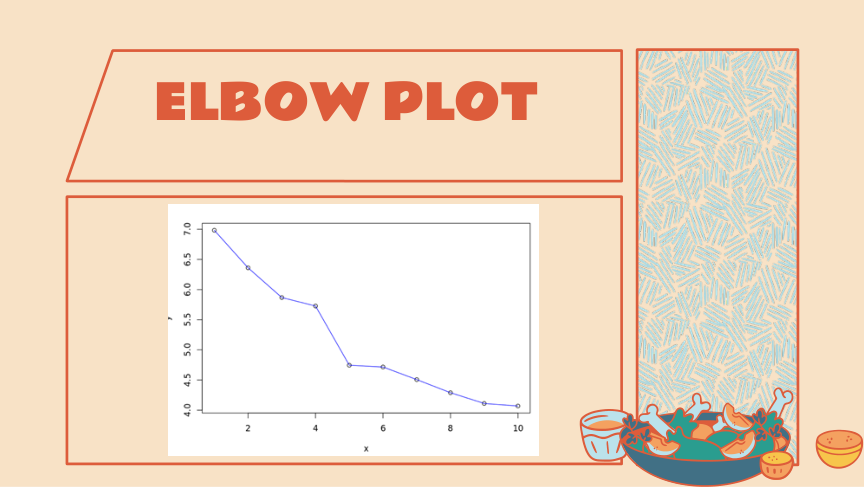
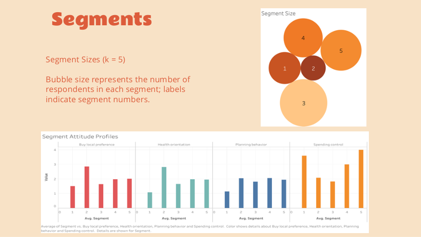
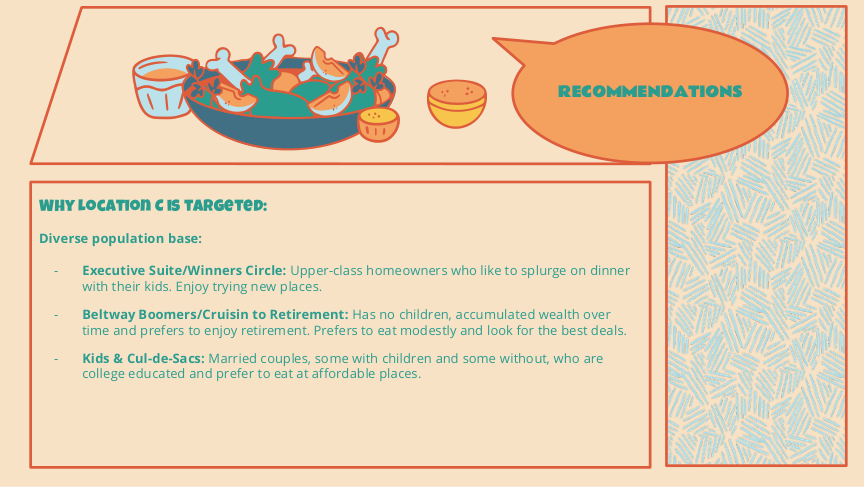

# Sticks Kebob Shop — Market Segmentation (K-means, R)

Market segmentation project using survey data to identify behavioral segments, profile them using descriptor variables, and recommend targeting + expansion strategy for a QSR concept.

## Highlights
- Method: K-means clustering (k = 5 selected via elbow method)
- Output: segment profiles/personas + targeting recommendation + expansion rationale
- Tools: R (analysis), Tableau (visual exploration)

## Repo Structure
- `code/` — R script for clustering + profiling
- `report/` — final write-up (PDF)
- `slides/` — presentation (PDF)
- `assets/` — key visuals (added next)

## Data Availability
Case materials and raw data are not included in this repository due to licensing restrictions.

## Visuals

### Elbow Plot (k selection)

### Segment Profiles + Sizes (k = 5)

### Location Recommendation

